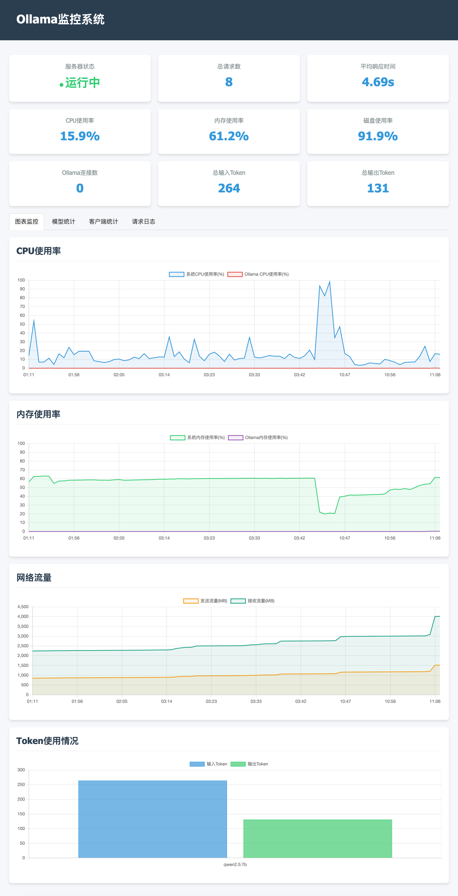

 # Ollama Monitor

 [](https://opensource.org/licenses/MIT) [](https://www.python.org/)

 [English](README.md) | [中文](README_CN.md)

## A simple Ollama usage monitor

## Features

- **Real-time Dashboard**: Monitor the status of your Ollama service through a browser interface
- **Complete Request Statistics**: Track all API requests, including client IPs, requested models, input/output tokens
- **System Resource Monitoring**: Monitor CPU, memory, disk usage, and network traffic
- **Model Usage Analytics**: Analyze usage frequency and performance of different models
- **Interactive Visualizations**: View key metrics with interactive charts
- **API Proxy Capability**: Can function as a proxy server for Ollama API calls
- **System Service Support**: Can be deployed as a system daemon for long-term stable operation



## Quick Start

### Install Dependencies

```bash
pip install flask waitress requests psutil
```

### Start the Monitor

```bash
python ollama_monitor.py
```

After startup, access `http://localhost:8080` in your browser to view the monitoring dashboard.

### Install as a System Service

```bash
python ollama_monitor.py --install
```

Then follow the terminal prompts to complete the system service installation:

```bash
sudo cp /tmp/ollama-monitor.service /etc/systemd/system/
sudo systemctl daemon-reload
sudo systemctl enable ollama-monitor
sudo systemctl start ollama-monitor
```

## Configuration Options

You can modify the following configuration parameters at the top of the script:

```python
# Configuration parameters
OLLAMA_HOST = "http://localhost:11434"  # Ollama service address
MONITOR_INTERVAL = 60  # Monitoring interval (seconds)
WEB_HOST = "0.0.0.0"   # Web service listening address
WEB_PORT = 8080        # Web service listening port
DB_FILE = "ollama_metrics.db"  # Database file path
```

## Monitoring Metrics

### System Metrics

- Server Status: Whether the Ollama service is running normally
- CPU Usage: System and Ollama process CPU usage
- Memory Usage: System and Ollama process memory usage
- Disk Usage: System disk space usage
- Network Traffic: Sent and received network data

### Request Metrics

- Total Requests: Total number of API requests processed
- Average Response Time: Average response time for requests
- Input/Output Tokens: Total input and output tokens processed
- Client IP Statistics: Request count statistics by IP address
- Model Usage Statistics: Usage frequency and performance data for each model

## Using as an API Proxy

In addition to monitoring, this tool can also function as a proxy for Ollama API services. Access the API through:

```
http://your-server:8080/ollama/api/...
```

All requests will be logged and included in the statistics.

## Data Storage

All monitoring data is stored in a SQLite database, defaulting to `ollama_metrics.db`. You can use any SQLite browser tool to view or analyze this data.

## System Requirements

- Python 3.7+
- Operating System: Linux, macOS, or Windows
- Any platform that supports the Ollama service

## Contributing

Bug reports and feature requests are welcome! If you'd like to contribute code, please open an issue first to discuss the changes you'd like to make.

## License

MIT License - See the [LICENSE](https://poe.com/chat/LICENSE) file for details.

## Acknowledgements

- [Ollama](https://github.com/ollama/ollama) - Amazing tool for running large language models locally
- [Flask](https://flask.palletsprojects.com/) - Provides web service functionality
- [Chart.js](https://www.chartjs.org/) - Provides data visualization capabilities
- [Waitress](https://docs.pylonsproject.org/projects/waitress/) - Provides production-grade WSGI server

## Contact

For questions or suggestions, please submit through GitHub Issues.

------

We hope Ollama Monitor helps you manage and monitor your Ollama service more effectively!
